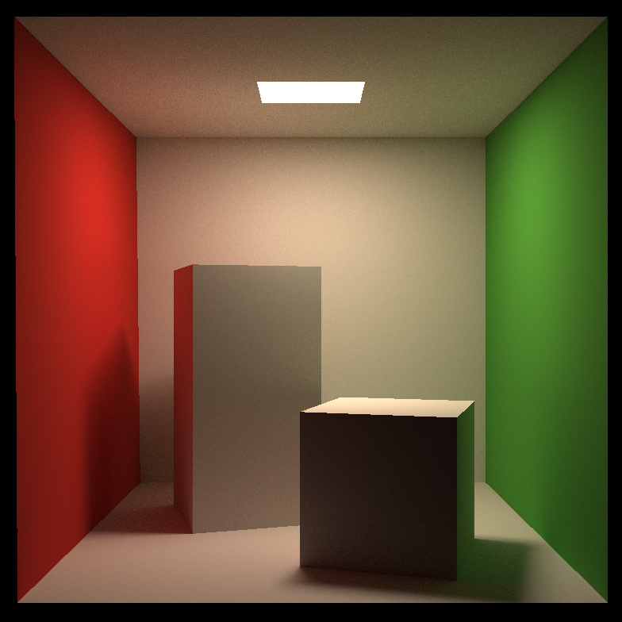

# Path Tracing: Cornell Box

Final Result with image size 784x784, and 1024 ray casting out per pixel takes roughly 20 minutes to render under multi-thread acceleration, BVH tree optimization and `-O3` flag on CPU `Intel(R) Core(TM) i7-8565U CPU (4 Cores 8 Threads) @ 1.80GHz`.

